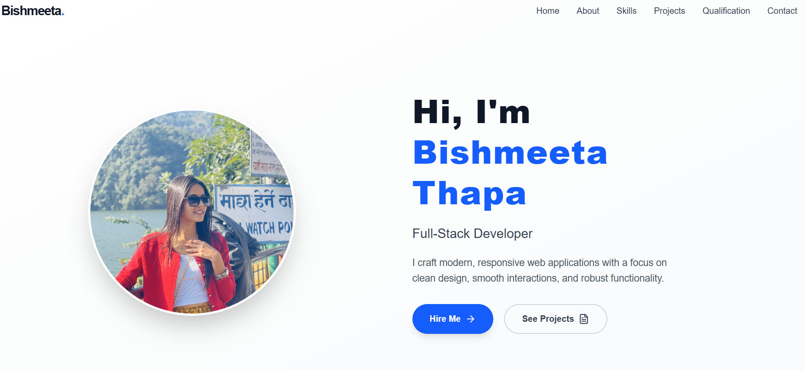
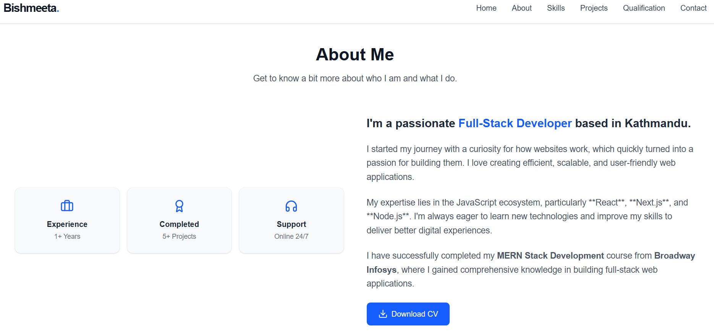
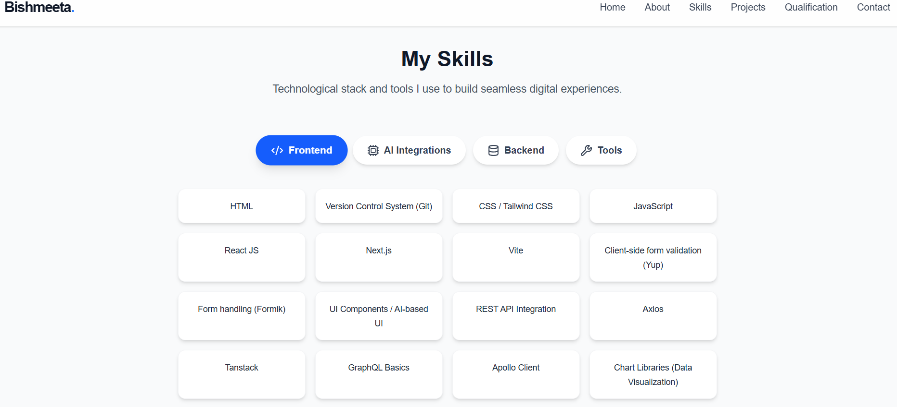
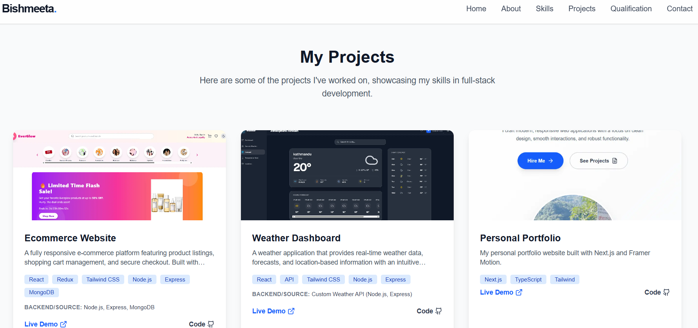
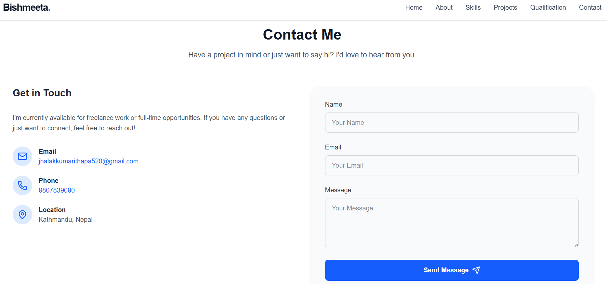

✨ Personal Portfolio
A modern, responsive, and interactive personal portfolio website built with Next.js, React, and Tailwind CSS. This project showcases my skills, experience, and complete project history with an engaging and user-friendly design.

### 📸 Screenshots
<p align="center">
  
  <br>
  <br>
  
  <br>
  <br>
  
  <br>
  <br>
  
  <br>
  <br>
  
</p>

**🌐 Live Demo:** [View Live Site](https://my-portfolio-zeta-one-b8oxqn8uuu.vercel.app/)

🚀 Features
🔹 Level 1: Core Sections (Fundamentals)
 🏠 Hero Section: Engaging introduction with dynamic elements and elegant typography.
 👤 About Me: Personal background and professional journey using clean information cards.
 🛠️ Skills Showcase: Visual representation of technical proficiencies and tools.
 🎓 Qualifications: Timeline of education and relevant work experience.

🔹 Level 2: Interactive Elements (Engagement)
 📂 Projects Gallery: Highlighted case studies of past work including E-commerce, Weather-dashboard, Tic Tac Toe, and more.
 ✉️ Contact Form: Functional direct messaging integration using Next.js API Routes and Nodemailer.
 ✨ Smooth Animations: Powered by Framer Motion for engaging entry animations, hover effects, and transitions.
 📱 Fully Responsive: Optimized layouts for mobile, tablet, and desktop viewing.

📂 Project Structure
```
my-portfolio/
├── app/                        # Next.js App Router
│   ├── api/                    # API endpoints
│   │   └── send-email/         # Email sending API route
│   ├── components/             # Reusable UI sections
│   │   ├── About/              # About section with info cards
│   │   ├── Contact/            # Contact form with validation
│   │   ├── Footer/             # Footer with social links
│   │   ├── Hero/               # Hero section with animations
│   │   ├── Navbar/             # Responsive navbar with glassmorphism
│   │   ├── Projects/           # Project gallery with details
│   │   ├── Skills/             # Skills showcase section
│   │   └── qualification/      # Education & experience timeline
│   ├── portfolio/              # Portfolio sub-route
│   ├── globals.css             # Global styles & Tailwind directives
│   ├── layout.tsx              # Root layout & SEO metadata
│   └── page.tsx                # Main entry point
├── public/                     # Static assets and images
│   ├── skills/                 # Skill icons
│   │   ├── css.png
│   │   ├── github.png
│   │   ├── graphql.png
│   │   ├── html.png
│   │   ├── javascript.png
│   │   ├── next.png
│   │   ├── node.png
│   │   ├── react.png
│   │   ├── redux.png
│   │   ├── rest api.png
│   │   └── tailwind.png
│   ├── about.png
│   ├── calculator.png
│   ├── contact.png
│   ├── ecommerce.png
│   ├── portfolio.png
│   ├── profile.png
│   ├── projects.png
│   ├── quizz.png
│   ├── skills.png
│   ├── tic-tac-toe.png
│   ├── todolist.png
│   └── weather.png
├── .env.example               # Environment variables template
├── .env.local                 # Local environment variables
├── next.config.ts             # Next.js configuration
├── package.json                # Dependencies & scripts
├── tsconfig.json               # TypeScript configuration
└── README.md                   # You are here!
```

🛠️ Tech Stack
Frontend: Next.js 16 (App Router), React 19, Tailwind CSS v4, Framer Motion, Lucide React.
Backend: Next.js API Routes.
Email Integration: Nodemailer.
Language: TypeScript.

⚙️ Installation
Prerequisites
Node.js (v18+)
npm or yarn

Steps
Clone the repository:

git clone https://github.com/BishmeetaThapa/portfolio.git
cd portfolio/my-portfolio

Install dependencies:

npm install

Create a .env.local file in the root directory (for email functionality):

EMAIL_USER=your_email@example.com
EMAIL_PASS=your_email_password

Start the development server:

npm run dev

Open your browser:
Navigate to http://localhost:3000 to view your portfolio.

📖 Usage
Explore Sections: Navigate through the About, Skills, and Qualifications areas to learn about my background.
View Projects: Check out real-world projects with links to GitHub and live demos.
Contact: Use the functional contact form to send a direct message, which processes securely via the Next.js API backend.

🤝 Contributing
Contributions, issues, and feature requests are welcome! Please feel free to check the issues page or submit a Pull Request.

📄 License
Distributed under the MIT License. See LICENSE for more information.

---
Created by Bishmeeta Thapa
